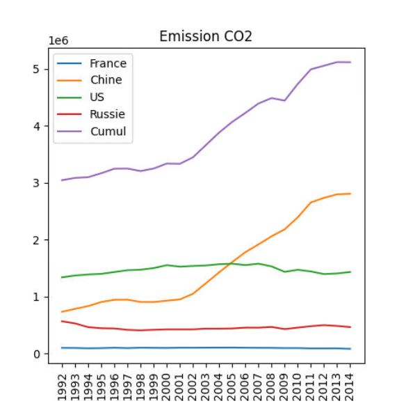
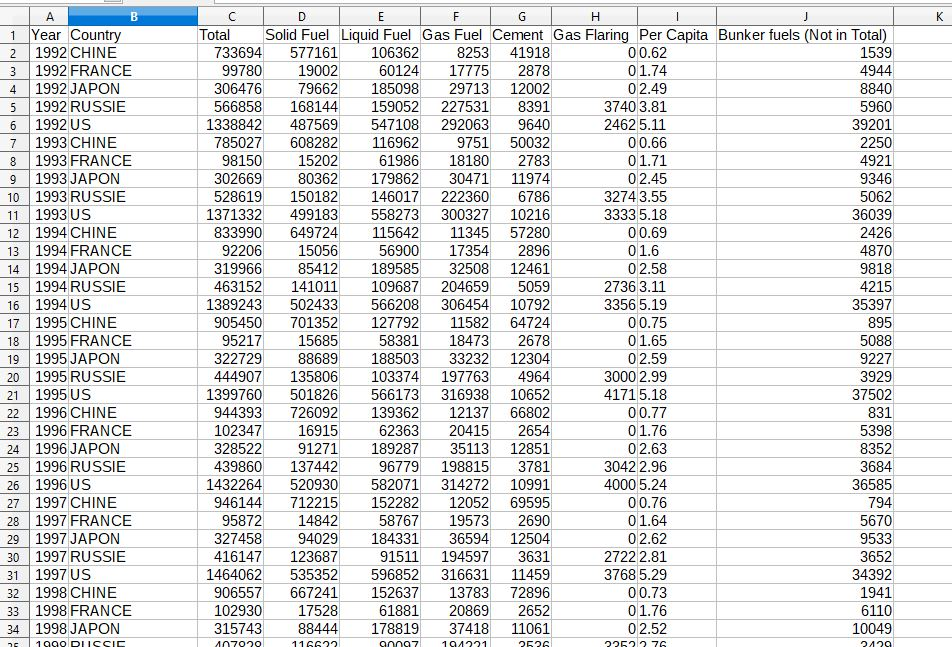
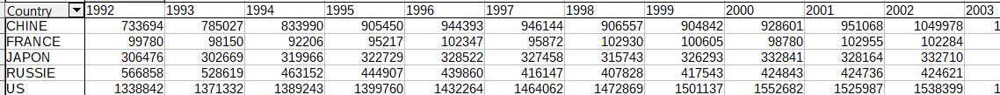

# emission_co2: Accès aux données

Actuellement on constate une diminution des émissions de gaz à effet de serre due au ralentissement
de l'activité éconmoique mondiale. Des organismes suivent ces évolutions à des fins d'analyse.
Datahub est une organisation qui offre des collections de données dans bon nombre de domaines.
Ici, nous nous intéressons à l'évolution des émissions de CO2.

Accès aux données brutes sur leur espace github : 
https://github.com/datasets/co2-fossil-by-nation/blob/master/data/fossil-fuel-co2-emissions-by-nation.csv

Bien entendu, le fichier est trop volumineux. On vous propose une version plus légère couvrant les deux dernières décennies et se limitant à certains pays. fichiers excel ci-dessous.

## Objectif

L'objectif est développer une application Java (utiliser IDE Processing) pour :

* récupérer les données brutes de l'émission Co2 liée aux énergies fossiles **csv**,
* les croiser pour une exploitation plus aisée
* les filtrer par pays,
* Tracer un graphique de l'évolution des émissions annuelles.

## Etape 1: création d'un tableau croisé au format csv

Vous avez besoin de créer un tableau croisé permettant d'avoir une ligne par pays.

Il faut utiliser la fonction "tableau dynamique" de Exce ou Calc (aides-vous des ressources internet)

#### fichier de départ

#### résultat à obtenir

## Etape 2 : Téléchargement du fichier csv (par programmation!)

* `emissionco2v1.pde`

##  Etape 3 :Lecture du fichier csv

* `emissionco2v2.pde`

##  Etape 4 :Filtrage des données pour un pays

* `emissionco2v3.pde`

##  Etape 5 :tracer les courbes d'évolution de la consommation

On tracera les courbes de l'évolution de la consommation pour les US, la Chine et la France

* `emissionco2v4.pde`

