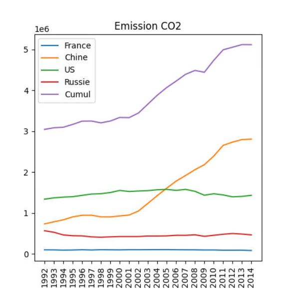
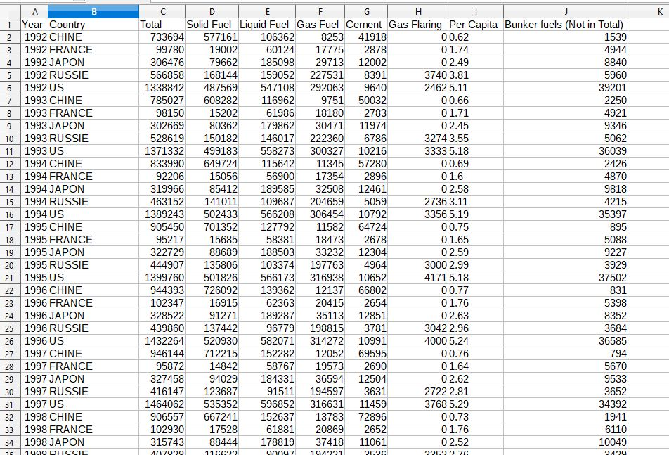
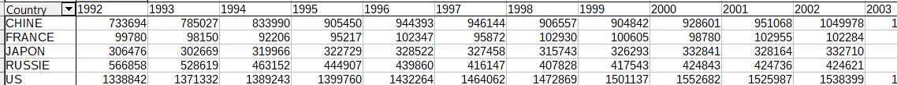
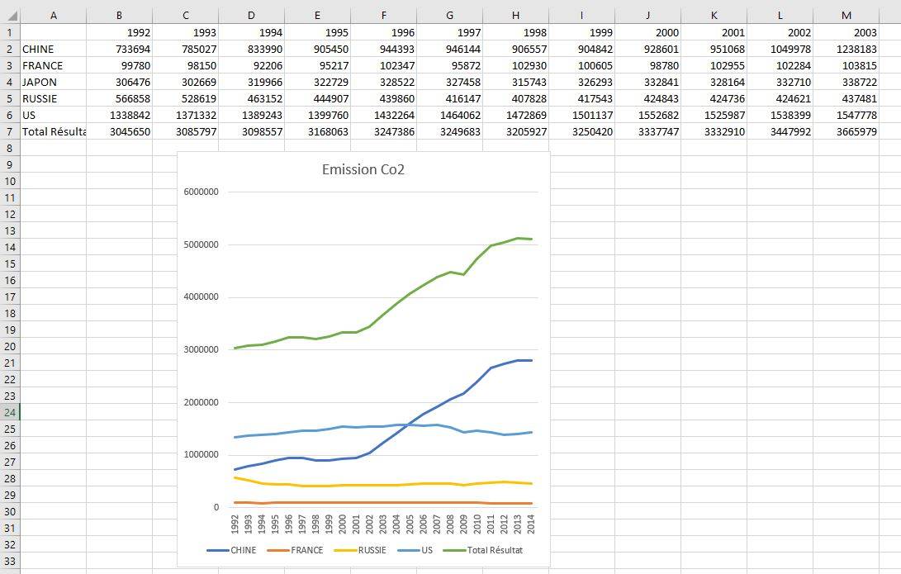

# Emission CO2: Traitement des données
***
Actuellement on constate une diminution des émissions de gaz à effet de serre due au ralentissement
de l'activité éconmoique mondiale. Des organismes suivent ces évolutions à des fins d'analyse.
Datahub est une organisation qui offre des collections de données dans bon nombre de domaines.
Ici, nous nous intéressons à l'évolution des émissions de CO2.

Accès aux données brutes sur leur espace github : 
https://github.com/datasets/co2-fossil-by-nation/blob/master/data/fossil-fuel-co2-emissions-by-nation.csv
  

> pour information, le site https://www.data.gouv.fr/fr/datasets/?format=csv offre une multitude de dataset csv

Bien entendu, le fichier est trop volumineux. On vous propose une version plus légère couvrant les deux dernières décennies et se limitant à certains pays. fichiers excel ci-dessous.
***
## Objectif

L'objectif est développer une application Java (utiliser IDE Processing) pour :

* récupérer les données brutes de l'émission Co2 liée aux énergies fossiles **csv**,
* les croiser pour une exploitation plus aisée
* les filtrer par pays,
* Tracer un graphique de l'évolution des émissions annuelles.

***

## Ressources
1. [CSV Common Seperated Values](https://fr.wikipedia.org/wiki/Comma-separated_values#Basic_rules)
2. [Données et processing (TP)](https://pixees.fr/informatiquelycee/procAnDo_a1.html)
2. [Référence Processing](https://processing.org/reference/);
2. [Vidéo sur la classe Tabular de Processing](https://youtu.be/woaR-CJEwqc) et [sur le site Processing: tabular data](https://processing.org/tutorials/data/) 
2. [Vidéo - ArrayList in processing](https://youtu.be/HnSJZ4qTcwY)
3. [Vidéo sur la classe Pvector de Processing](https://youtu.be/7nTLzLf7jUg)
4. [Page PVector](https://processing.org/reference/PVector.html)
5. [Vidéo - Installer une librairie Processing](https://youtu.be/MMbubxV6SzE)
8. Je ne vous recommande pas d'utiliser de librairies graphiques, cependant je vous indique quelques unes si vous décidez le contraire : [grafica](https://jagracar.com/sketches/defaultPlot.php), [gicentre](https://www.gicentre.net/utils/chart) ...

***
## Etape 1: création d'un tableau croisé au format csv

Vous avez besoin de créer un tableau croisé permettant d'avoir une ligne par pays.

Il faut pour cela utiliser la fonction "tableau dynamique" de Excel ou Calc (aidez-vous des ressources internet)

#### fichier de départ

#### résultat à obtenir

***
## Etape 2 : Courbe de votre tableur 
Avant de commencer votre programmation, générer le graphique avec votre tableur préféré 

En principe vous devriez obtenir un graphique comme celui-ci :

***
##  Etape 3 :Lecture du fichier csv
Référez-vous au programme suivant et complétez-le 
* `emissionco2v1.pde`
***
##  Etape 4 :Filtrage des données pour un pays et sa courbe
Référez-vous au programme suivant et complétez-le 
* `emissionco2v2.pde`
***
##  Etape 5 :Production des courbes d'évolution CO2 de tous les pays avec les axes graduées
On tracera les courbes d'évolution CO2 pour les US, la Chine et la France
>**_L'utilisation d'une librairie est peu recommandée. Vous allez passer plus de temps à apprendre à l'utiliser qu'à réflechir à votre propre solution (simple somme toute)_**

Référez-vous au programme suivant et complétez-le 
* `emissionco2v3.pde`
***
##  Optionnel : Pour aller plus loin
- Etendre les filtrages aux types des énergies fossiles par pays
- Afficher les données relatives à une période : ex de 1970 à 1990
- Exploiter le fichier complet du site : d'abord en le téléchargeant et ensuite en y accédant par le lien url (utiliser [le lien raw](https://raw.githubusercontent.com/datasets/co2-fossil-by-nation/master/data/fossil-fuel-co2-emissions-by-nation.csv))
- IHM permettant de sélectionner les pays et les années
- Reprogrammer l'ensemble avec des classes (Programmation objet OOP)
- Tester avec d'autres données : sur le même datatsets ou www.data.gouv.fr/fr/datasets/?format=csv

